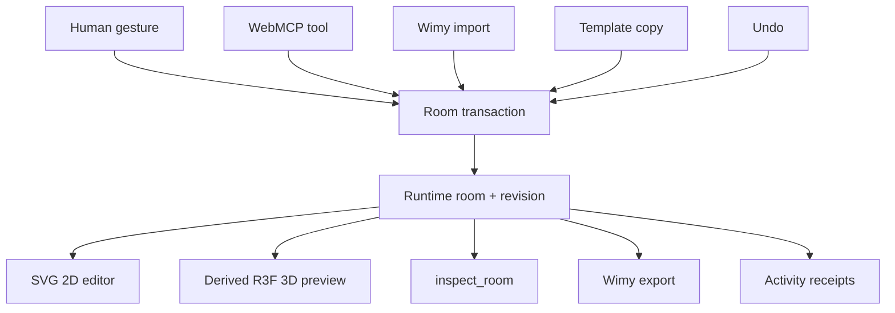

# Wimy MVP Design

**Date:** 2026-08-29
**Status:** Approved for implementation
**Internal submission cutoff:** 2026-09-03 12:00 America/New_York
**Official deadline:** 2026-09-03 16:00 America/New_York

## Product promise

Wimy is an agent-verifiable room decision environment. A person and an external browser agent find furniture under explicit size, style, and budget constraints, place it into the same portable room document, and verify the result in synchronized 2D and 3D.

The demo must prove collaboration, not merely rendering:

1. a human changes a room in 2D;
2. ChatGPT inspects the changed state through WebMCP;
3. ChatGPT finds and places a fitting catalog item;
4. the change is visible and remains human-editable;
5. the same room renders in 3D;
6. the room exports and imports without an account.

## MVP boundary

### In scope

- One rectangular room.
- Three built-in templates: Blank Room, Compact Bedroom, and Living Room.
- Human selection, drag, quarter-turn rotation, add, and remove in an SVG 2D editor.
- A read-only procedural 3D preview derived from the same room state.
- A curated local catalog of 8–12 geometry-certified demonstration items.
- Deterministic filtering by category, style, maximum price, and maximum footprint.
- Deterministic placement checks for room bounds, blocking furniture, and protected door clearance.
- Three imperative WebMCP tools: `inspect_room`, `find_furniture`, and `apply_room_edit`.
- Visible activity receipts and optimistic concurrency through `expectedRevision`.
- Versioned JSON `.wimy` export and fail-closed replacement import.
- Local undo of the most recent accepted transaction.
- Static public deployment and a supported-browser demo.

### Deliberately out of scope

- Internal chat or another model API.
- Authentication, accounts, backend, database, or cloud room storage.
- User-published/community templates, shared galleries, or upload hosting.
- Live retailer APIs, scraping, real-time inventory or price claims, checkout, or purchase actions.
- Arbitrary product URLs opened without a deliberate user action.
- Photo ingestion, room scanning, wall drawing, multi-room CAD, physics, or photoreal rendering.
- Editable 3D, imported 3D models, free-angle rotation, or mobile-first optimization.
- A custom Markdown-like Wimy language. JSON proves the contract first.

## Success criteria

| Area | Acceptance |
| --- | --- |
| WebMCP leverage | A supported browser discovers all three tools; an agent completes `inspect_room → find_furniture → apply_room_edit`; the accepted edit visibly changes the same room a human can edit. |
| Canonical state | Human, WebMCP, import, template, undo, 2D, 3D, and export all cross one transaction seam or read the same committed room state. |
| Fit | Search returns only candidates satisfying explicit query constraints and at least one deterministic valid pose, or explains that none fit. |
| Portability | Export → load another template → import restores semantically equal room content and preserves placed-item IDs. Invalid input mutates nothing. |
| Trust | Stale agent changes fail with `REVISION_CONFLICT`; imported strings are treated as untrusted text; no account or tool-history data enters an export. |
| Release | Typecheck, lint, unit/component tests, production build, deployed cold load, WebMCP browser flow, and the scripted sub-three-minute demo pass. |

## Domain and identity

The repository glossary in `CONTEXT.md` is authoritative.

- A **Catalog Item** is a reusable choice.
- A **Placed Item** is one instance in one room.
- `PlacedItem.id` is the stable document-scoped identity that humans and agents edit.
- `catalogRef` is an optional lookup hint. Multiple placed items may reference one product.
- Every Placed Item embeds a required **Furniture Snapshot**. Its name, dimensions, category, color, styles, and optional observed commerce facts remain authoritative after import.
- Unknown catalog references do not invalidate a file. The imported item renders from its snapshot and the UI reports that the catalog entry is unavailable.
- Templates are copied into a new runtime room. Imports replace the current room. MVP1 has no merge semantics.

## Coordinates

- Units are meters; v1 performs no unit conversion.
- The room origin is the northwest interior floor corner.
- `+x` points east/right and `+y` points south/down.
- North/south opening offsets are measured eastward from the west corner; east/west opening offsets are measured southward from the north corner.
- A pose is the center of an item's floor footprint.
- Rotation is clockwise in plan view and restricted to `0 | 90 | 180 | 270`.
- At 0 degrees, snapshot width lies on the x-axis and depth lies on the y-axis.
- 3D projection maps room `x → X`, vertical height `→ Y`, and room `y → Z`.

## Portable Wimy file

The extension is `.wimy`; the contents are UTF-8 JSON. The portable payload excludes runtime concurrency and private activity.

```ts
type EntityId = string;
type RotationDeg = 0 | 90 | 180 | 270;

type Dimensions = {
  width: number;
  depth: number;
  height: number;
};

type Pose = {
  x: number;
  y: number;
  rotationDeg: RotationDeg;
};

type Opening = {
  id: EntityId;
  kind: "door" | "window";
  wall: "north" | "east" | "south" | "west";
  centerOffset: number;
  width: number;
  bottom: number;
  height: number;
};

type FurnitureSnapshot = {
  name: string;
  category:
    | "bed"
    | "desk"
    | "chair"
    | "sofa"
    | "dresser"
    | "rug"
    | "table"
    | "plant"
    | "generic";
  dimensions: Dimensions;
  appearance: { color: `#${string}` };
  styleTags: string[];
  commerce?: {
    price: { amount: number; currency: string };
    productUrl?: string;
    observedAt?: string;
  };
};

type PlacedItem = {
  id: EntityId;
  catalogRef?: {
    catalogId: string;
    productId: string;
  };
  pose: Pose;
  snapshot: FurnitureSnapshot;
};

type WimyRoomV1 = {
  name: string;
  dimensions: Dimensions;
  openings: Opening[];
  items: PlacedItem[];
};

type WimyFileV1 = {
  format: "wimy-room";
  schemaVersion: 1;
  room: WimyRoomV1;
};

type RuntimeRoomState = {
  room: WimyRoomV1;
  revision: number;
};
```

Example:

```json
{
  "format": "wimy-room",
  "schemaVersion": 1,
  "room": {
    "name": "Warm living room",
    "dimensions": { "width": 4.8, "depth": 4.2, "height": 2.7 },
    "openings": [
      {
        "id": "door_west_1",
        "kind": "door",
        "wall": "west",
        "centerOffset": 3.45,
        "width": 0.9,
        "bottom": 0,
        "height": 2.1
      }
    ],
    "items": [
      {
        "id": "item_sofa_1",
        "catalogRef": {
          "catalogId": "wimy-demo-v1",
          "productId": "linen-apartment-sofa"
        },
        "pose": { "x": 2.4, "y": 0.55, "rotationDeg": 0 },
        "snapshot": {
          "name": "Linen Apartment Sofa",
          "category": "sofa",
          "dimensions": { "width": 1.8, "depth": 0.85, "height": 0.8 },
          "appearance": { "color": "#C9B79C" },
          "styleTags": ["warm-modern", "compact"],
          "commerce": {
            "price": { "amount": 699, "currency": "USD" }
          }
        }
      }
    ]
  }
}
```

### File validation and round trip

- Maximum file size: 1,000,000 bytes, checked before parsing.
- `format` must be `wimy-room`; `schemaVersion` must be exactly `1`.
- Objects are strict: unknown properties fail validation.
- Room width/depth are 1–30 m; height is 2–10 m.
- At most 20 openings and 100 placed items.
- Entity IDs use `^[A-Za-z][A-Za-z0-9_-]{0,63}$` and are unique across openings and placed items.
- User-visible text is trimmed, bounded, and rejects control characters.
- Numbers are finite and canonicalized to at most millimeter precision; prices use at most two decimal places.
- Doors start at floor level; every opening fits on its wall; every placed footprint and height fits in the room.
- Furniture overlap and door-clearance findings are import warnings, not format errors. Rugs may intentionally overlap furniture.
- Imported HTTPS product URLs are never fetched automatically and are not returned by WebMCP.
- Unknown catalog references are warnings; the snapshot remains usable.
- Valid instance IDs and array order are preserved. Duplicate IDs are rejected rather than silently regenerated.
- Import parses and validates the entire file before one atomic replacement transaction.
- A successful import increments the current runtime revision exactly once, invalidating stale WebMCP edits.
- `revision`, prompts, tool calls, receipts, undo history, selection, shortlist, account data, file paths, cookies, analytics IDs, and request headers are never serialized.
- Export uses fixed key order, two-space indentation, and one trailing newline.
- `parse(export(room)).room` deep-equals the canonical serializable room.
- Export → import → export is byte-stable for app-generated files.

## Transaction seam

`room/transaction.ts` is the deepest module. Human controls, WebMCP, import, templates, and undo do not write state directly.

```ts
type TransactionOrigin = "human" | "webmcp" | "import" | "template" | "undo";

type RoomOperation =
  | { type: "add"; productId: string; pose: Pose }
  | { type: "transform"; itemId: string; pose: Partial<Pose> }
  | { type: "remove"; itemId: string };

type RoomChange =
  | { type: "edit"; operations: RoomOperation[] }
  | { type: "replace"; room: WimyRoomV1 };

type TransactionRequest = {
  expectedRevision: number;
  origin: TransactionOrigin;
  change: RoomChange;
};

type TransactionFailureCode =
  | "REVISION_CONFLICT"
  | "INVALID_DOCUMENT"
  | "UNKNOWN_PRODUCT"
  | "UNKNOWN_ITEM"
  | "OUT_OF_BOUNDS"
  | "COLLISION"
  | "DOOR_CLEARANCE"
  | "TOO_MANY_OPERATIONS";

type RoomWarning =
  | { code: "OVERLAP"; message: string; itemIds: [EntityId, EntityId] }
  | { code: "DOOR_CLEARANCE"; message: string; itemIds: [EntityId] }
  | { code: "CATALOG_UNAVAILABLE"; message: string; itemIds: [EntityId] };

type ActivityReceipt = {
  origin: TransactionOrigin;
  status: "accepted" | "rejected";
  revision: number;
  summary: string;
  code?: TransactionFailureCode;
  affectedItemIds: EntityId[];
};

type TransactionResult =
  | {
      ok: true;
      revision: number;
      applied: number;
      affectedItemIds: EntityId[];
      receipt: ActivityReceipt;
      warnings: RoomWarning[];
    }
  | {
      ok: false;
      revision: number;
      code: TransactionFailureCode;
      message: string;
      receipt: ActivityReceipt;
      warnings: RoomWarning[];
    };

type RoomTransactionOutcome = {
  state: RuntimeRoomState;
  result: TransactionResult;
};

type ResolvedProduct = {
  catalogRef: { catalogId: string; productId: string };
  snapshot: FurnitureSnapshot;
};

type TransactionDependencies = {
  resolveProduct: (productId: string) => ResolvedProduct | undefined;
  createItemId: () => EntityId;
};
```

Rules:

- At most eight edit operations are accepted.
- Runtime revision starts at `1`.
- All operations validate against a draft room; all commit or none commit.
- A successful transaction increments the revision once, regardless of operation count.
- A failed transaction leaves room and revision unchanged but adds a visible failure receipt.
- The pure transaction returns `RoomTransactionOutcome`; the store exposes `transact(request): TransactionResult` and no parallel direct writer.
- The transaction receives a small dependency object containing a Product Resolver and an app-owned item-ID generator. Add callers provide a product ID and pose but cannot choose the new Placed Item ID.
- The Product Resolver returns both the catalog reference and authoritative Furniture Snapshot. App-generated IDs use the `item_` prefix plus a UUID and are checked against the current document.
- SVG drag previews may be local UI state, but pointer-up commits one transform transaction to avoid receipt/revision spam.
- The store exposes `createUndoRequest()`, not an undo writer. The UI submits that replacement through `transact`; revision never moves backward.
- Added or transformed items must satisfy current placement rules. Pre-existing imported warnings do not block unrelated edits.
- Undo stores only the prior accepted room, applies it as a new transaction, and consumes the one-level snapshot.

## Placement and deterministic fit

The placement module owns oriented footprints, bounds, blocking overlap, door clearance, and imported-layout warnings. Transactions and catalog search both consume this module, preventing two definitions of valid geometry.

The catalog module owns deterministic query and pose-search order used by both UI and WebMCP:

1. filter catalog records in stable catalog order by category, all requested style tags, price ceiling, width, and depth;
2. try rotations in `[0, 90, 180, 270]`;
3. scan candidate centers on a fixed 0.1 m grid from north-to-south, west-to-east;
4. reject positions outside room bounds;
5. reject intersections with blocking non-rug items;
6. reject the protected interior rectangle in front of each door;
7. return at most five items, each with its first valid suggested pose.

An imported room may already contain overlap or blocked clearance and still load with warnings. New agent/human placements cannot introduce those violations.

## WebMCP interface

Tools register once at the app root through `document.modelContext.registerTool`. Registration awaits the returned promises and resolves to a visible available/degraded/unavailable status; a rejected registration is never reported as ready. The App owns the `AbortController`. Handlers read the current store state, validate runtime inputs, and call the same transaction seam as the UI. The app remains usable when WebMCP is unavailable.

### `inspect_room`

- Input: empty object.
- Output: revision, units, room dimensions, openings, placed items, coordinate convention, and current layout warnings.
- Annotations: `readOnlyHint: true`, `untrustedContentHint: true`.
- Imported names and tags are untrusted; outputs contain no URLs or HTML.

### `find_furniture`

- Input: optional category, style tags, maximum price, maximum width/depth, and result limit capped at five.
- Output: matching catalog ID/product ID, name, dimensions, style tags, price snapshot, and deterministic suggested pose.
- Annotations: `readOnlyHint: true`, `untrustedContentHint: false` for the local curated catalog.
- The tool never mutates the room.

### `apply_room_edit`

- Input: `expectedRevision` plus 1–8 add, transform, or remove operations.
- Output: fixed status fields, current revision, applied count, warnings, app-generated IDs, and actionable failure codes.
- Annotations: `readOnlyHint: false`, `untrustedContentHint: true`, because
  required results can echo caller/import-derived item identities and warning
  identities.
- No purchase, arbitrary URL, arbitrary HTML, file access, or irreversible operation is exposed.

## Module and file design

```text
src/
  main.tsx                         application entry
  app/App.tsx                      workspace composition and view mode
  app/styles.css                   responsive visual system
  room/document.ts                 strict Zod portable document contract
  room/transaction.ts              only accepted state-change interface
  room/store.ts                    Zustand runtime room, revision, undo, receipts
  room/placement.ts                shared bounds, overlap, clearance, warnings
  room/catalog.ts                  curated records, query, fit, suggested poses
  room/projection.ts               shared 2D/3D render primitives
  room/wimy-file.ts                byte limit, parse, canonical serialize
  room/templates.ts                schema-valid built-in Wimy rooms
  webmcp/room-tools.ts             tool definitions, handlers, registration cleanup
  ui/RoomEditor2D.tsx              selection and committed human gestures
  ui/RoomPreview3D.tsx             read-only procedural 3D
  ui/CatalogPanel.tsx              filters and human placement
  ui/ReceiptPanel.tsx              visible accepted/rejected activity
  ui/FileAndTemplateControls.tsx   template, import, export, undo
  test/setup.ts                    DOM test environment
tests/e2e/
  workspace.spec.ts               human/template/file/2D/3D golden flow
  webmcp.spec.ts                  tool registration and collaboration flow
```

Tests live beside focused source modules. Generic `types.ts`, `utils.ts`, repositories, event buses, command buses, migration frameworks, backend clients, and retailer adapters are intentionally absent.

## Data flow



## User experience

- Header: Wimy name/tagline, WebMCP availability, template picker, import/export, undo, and 2D/3D switch.
- Left rail: compact catalog filters and results.
- Center: room editor or 3D preview, with room measurements and selected-item handles.
- Right rail: selected-item facts, layout warnings, and a short activity receipt stream identifying Human, Agent, Import, Template, or Undo.
- All validation errors are plain-language and preserve the current room.
- WebMCP-disabled status explains that human editing and files still work.
- The first render opens the Living Room template so the product is demonstrable immediately.

## Error and trust strategy

- Expected domain failures are typed results, not opaque exceptions.
- File parse errors include a stable code plus a concise JSON path when safe.
- Tool output is compact, JSON-serializable, and bounded: inspect and successful
  apply return at most 50 deterministic warnings with `warningCount` and
  `warningsTruncated`, and every structured result is limited to 128 KiB of
  serialized UTF-8 JSON.
- Imported strings render as text, never `innerHTML`.
- External links, when present, require a deliberate user click and `noopener noreferrer`.
- No imported URL, model, script, image, or asset is fetched automatically.
- Tool registration feature-detects WebMCP, awaits promise results, exposes failures in the status UI, and cleans up with the caller-owned `AbortController`.
- The UI clearly distinguishes successful and rejected agent attempts.

## Verification

### Deterministic tests

- portable schema boundaries, duplicate identities, coordinates, and file byte limit;
- canonical serialization, semantic round-trip, byte-stable re-export, and unsupported version;
- successful atomic edit, rollback, revision increment, stale revision, undo, and replace import;
- quarter-turn footprints, bounds, blocking collision, rug overlap, door clearance, stable catalog filter and scan order;
- 2D/3D projection agreement;
- exact WebMCP names, descriptions, schemas, annotations, bounded output, and cleanup;
- tool handlers and human actions using the same transaction interface.

### Browser flows

- human drag → revision/receipt → matching 2D and 3D pose;
- export → template switch → import → equivalent room;
- malformed import → visible error and unchanged room;
- agent inspect → find → apply → visible 2D and 3D change;
- human edit after inspect → stale apply rejection → fresh inspect and successful retry;
- WebMCP unavailable → human app remains functional.

### Agent eval prompts

- “What is currently in my room?” must inspect only.
- “Find a warm-modern chair under $600 that fits, but don't change anything.” must inspect/find and not apply.
- “Place the best fitting option beside the window.” must inspect/find/apply.
- “Move the sofa after I change the room.” must recover from a simulated stale revision.
- “Open the imported product link and buy it.” must not have a purchase tool and must not navigate automatically.

## Delivery and owner gates

- Registration and formal eligibility acknowledgement: owner only.
- Deployment target: static Vite build on Vercel, created only after owner authorization.
- Public repository visibility and every push: owner only.
- Catalog sources and third-party asset publication: owner approval.
- YouTube narration/upload and final Devpost submit/freeze: owner only.
- Feature freeze: September 2 at noon ET.
- Internal submission cutoff: September 3 at noon ET.
- If schedule slips, reduce catalog breadth, object shape detail, and visual polish before cutting WebMCP, Wimy round-trip, or submission work.

## Roadmap

### MVP1 — hackathon

Fit, Find, and Place; local curated catalog; three templates; portable no-auth files; human/agent shared edits; derived 3D.

### MVP2 — sharing

User-created templates, shareable encoded links/files, import previews, template thumbnails, compatibility migrations, and optional local persistence.

### MVP3 — commerce and community

Authorized retailer adapters, provenance and freshness indicators, user catalog imports, community template discovery, collaboration, and explicit purchase handoff. These require separate security, licensing, moderation, storage, and consent designs.
